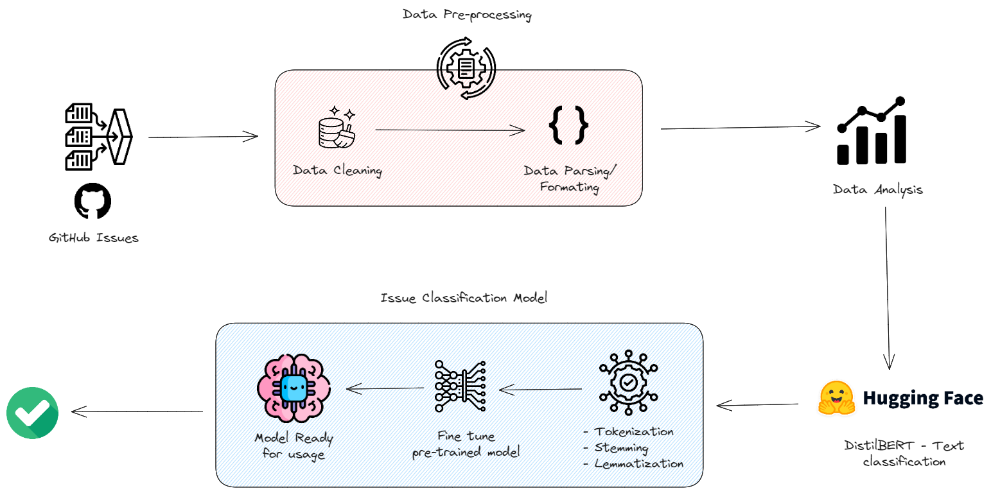
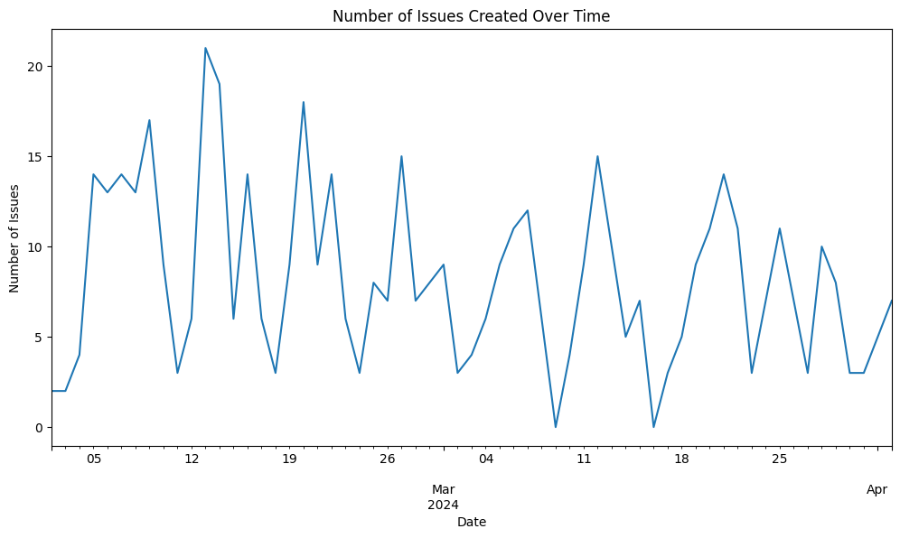
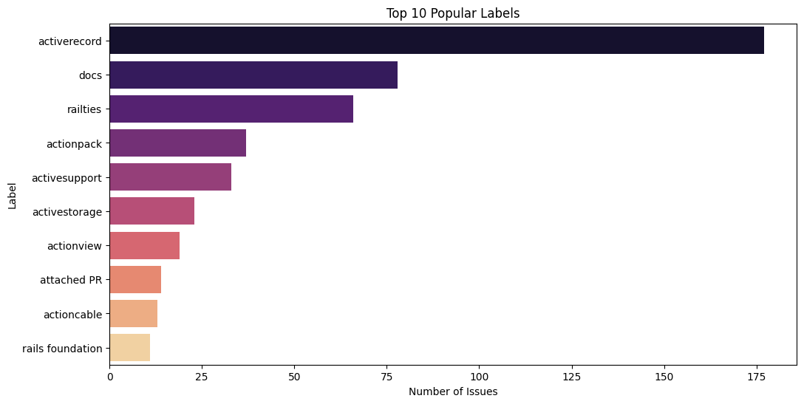
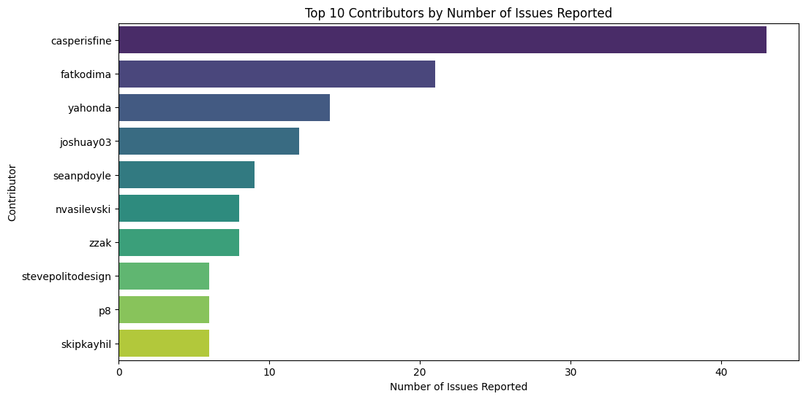
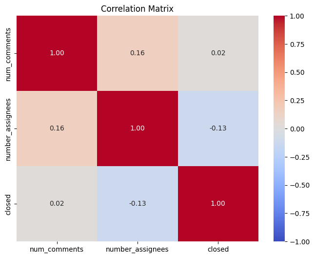

# GitHub Issues Classification

## Table of Contents

- [Introduction](#introduction)
- [Data Collection](#data-collection)
- [Data Preprocessing](#data-preprocessing)
- [Data Analysis](#data-analysis)
  - [Time Series Analysis](#time-series-analysis)
  - [Label Distribution](#label-distribution)
  - [Contributor Analysis](#contributor-analysis)
  - [Correlation Analysis](#correlation-analysis)
- [Issue Calssification](#issue-classification)
  - [Model Selection](#model-selection)
  - [Model Analysis & Evaluation](#model-analysis--evaluation)
- [Discussion & Future Work](#discussion--future-work)

## Introduction

The Rails repository on GitHub has a large number of issues reported by the community. These issues are related to feature requests, enhancements, etc. (activeRecord, PostgresSQL, encryption, ...). The maintainers of the Rails project need to classify these issues into different categories to prioritize and address them efficiently. The classification model will help in automating the process of categorizing the issues based on their descriptions. This project aims to build a machine learning model that can classify the GitHub issues into different labels based on their descriptions.

Figure below shows all the steps involved in the project:



## 1. Data Collection

The data for this project has been collected from the Rails repository on GitHub. The issues reported on the Rails repository are downloaded using the GitHub API. The issues are downloaded in `JSON` format, which contains information about the issue, such as the title, description, labels, and other metadata.

## 2. Data Preprocessing

In this phase of the project, the data is preprocessed to extract the relevant information from the `JSON` data downloaded from the GitHub API. The data is cleaned by removing any irrelevant content or formatting issues from the issue description and title (Markdown syntax, HTML tags, etc.) or missing values in the data. The date of each issue is converted into a numerical format for analysis.

This is the following data that has been extracted from the GitHub issues:

```python
{
  issue_id: ,
  title: str,
  body: str,
  state: str,
  closed: bool,
  created_at: Datetime,
  labels: [str],
  num_comments: int,
  closed_at: Datetime,
  issue_number: int,
  author: str,
  assignees: [str],
  number_assignees: int,
}
```

## 3. Data Analysis

- **Time Series Analysis**

An initial analysis focused on the trend of issue reporting over time, revealing a relatively stable volume with major fluctuations. Notably, a single day saw a peak of 21 reported issues.

<p align="center">
  
</p>

- **Label Distribution**

Further analysis showed a significant concentration of issues labeled as `activerecord` (173), indicating a predominant interest or concern within this area. Other labels such as `docs` and `raities` followed but with less frequency.

<p align="center">
  
</p>

- **Contributor Analysis**

Examination of issue contributions highlighted `casperisfine`, `fatkodima`, and `joshuay03` as top contributors, suggesting a small group of users significantly influences issue reporting.

<p align="center">
  
</p>

- **Correlation Analysis**

Then, we also studied the relationship between the number of comments, the number of assignees, and the time to resolution. The correlation matrix shows that there is a weak positive correlation between the number of comments and the number of assignees, indicating that more comments may require more assignees to resolve the issue. The correlation between the number of assignees and the time to resolution is weakly negative, suggesting that more assignees may lead to faster issue resolution. The correlation between the number of comments and the time to resolution is weakly positive, indicating that more comments may lead to longer resolution times.

<p align="center">
  
</p>

## 4. Issue Classification

### 4.1 Model Selection

The [`distilbert-base-uncased`](https://huggingface.co/distilbert/distilbert-base-uncased) model from the Hugging Face Transformers library has been used as the pre-trained model for text classification. The model is trained using the `transformers` library from Hugging Face.

Transformers are deep learning models excelling at processing sequential data like text. They use a mechanism called "attention" to identify relationships and dependencies between words or parts of a sentence. This allows them to understand the context of words better than older models like RNNs or LSTMs. Transformers have revolutionized Natural Language Processing (NLP). They power large language models (LLMs) like GPT-3 and form the backbone of advanced tasks like machine translation, text summarization, and question answering.

DistilBERT is a smaller, faster, and lighter version of BERT (a popular transformer model). It retains most of BERT's performance while being 40% smaller and 60% faster. DistilBERT is trained using a technique called "distillation," where a larger model (BERT) is used to train a smaller model (DistilBERT) by transferring knowledge from the larger model to the smaller one.

Before training the model, the data is preprocessed and tokenized using the `transformers.Tokenizer` class. Its primary purposes include: splitting the input text into words or subwords (Tokenization), converting tokens into numerical IDs (Encoding), and adding special tokens to mark the beginning and end of the input text ([CLS] and [SEP] tokens). Additionally, the data is splited into training and testing datasets using the `train_test_split` function from the `sklearn` library.

The model is then fine-tuned using the fetched GitHub issues to classify the issues into different labels. The model is evaluated using the test dataset to measure its performance in classifying the GitHub issues into different labels.

The hyperparameters used for training the model are as follows:

- **Batch size**: 64 => The number of training examples utilized in one iteration.
- **Learning rate**: 5e-5 => The step size at which the model is updated.
- **Number of epochs**: 2 => The number of times the model is trained on the entire training dataset.
- **Evaluation metric**: Accuracy, Precision, Recall, F1-score
- **Dropout rate**: 0.1 => The rate at which the model randomly drops connections between neurons.

### 4.2 Model Analysis & Evaluation

The success or failure of machine learning models depends on how we evaluate their performance. For text classification tasks, we typically use metrics like accuracy, precision, recall, and F1-score. These metrics help us understand how well the model is performing and where it might be failing.

- **Accuracy**: The proportion of correctly classified instances out of the total instances. It's a good metric when the classes are balanced. Our model achieved an accuracy of 0.85, indicating that it correctly classified 97% of the GitHub issues. This metric does not give us any class-specific information like which class boundaries were learned well, where the model was more confused, etc.
- **Precision**: The proportion of correctly classified instances out of the total instances classified as a particular class. It's a good metric when we want to minimize false positives. Our model achieved a precision of 0.95, indicating that it correctly classified 95% of the issues labeled as a particular class.
- **Recall**: The proportion of correctly classified instances out of the total instances that actually belong to a particular class. It's a good metric when we want to minimize false negatives. Our model achieved a recall of 0.97, indicating that it correctly classified 97% of the issues that actually belong to a particular class.
- **F1-score**: The harmonic mean of precision and recall. It's a good metric when we want to balance precision and recall. Our model achieved an F1-score of 0.96, indicating a very good balance between precision and recall.

### Discussion & Future Work

This project primarly aims to classify the GitHub issues reported on the Rails repository into different categories using machine learning techniques. The classification model will help in organizing and prioritizing the issues reported by the community, making it easier for the maintainers to address them efficiently. The project involves data collection, preprocessing, analysis, and classification of the GitHub issues. The model is trained using the `distilbert-base-uncased` model from the Hugging Face Transformers library and evaluated using metrics like accuracy, precision, recall, and F1-score. The model shows promising results in classifying the GitHub issues into different labels based on their descriptions.

Although the model performs well on the current dataset, there are several areas for improvement and future work:

- **Train/Test spilt** : The current dataset is split into training and testing datasets using a random split. A more robust approach, such as label-based splitting or cross-validation, could provide a better estimate of the model's performance.
- **Addressing Class Imbalance**: The current dataset exhibits class imbalance, which could affect the model's ability to learn from less frequent labels. Strategies such as oversampling minority classes or applying class-weighted loss functions could improve performance.
- **Improve data preprocessing steps**
- **Automation**: Automate the data collection, preprocessing, analysis, and reporting processes to make the project more efficient. For that, we can write scripts to automate these processes and set up a continuous integration pipeline to automatically update the analysis and classification model whenever new issues are posted on the Rails repository.
- **Expanding Model Capabilities**: Beyond classification, developing predictive models to assess issue priority or estimated resolution time could offer valuable insights for project management. Further refinement of classification models to better handle rare labels would also be beneficial.
